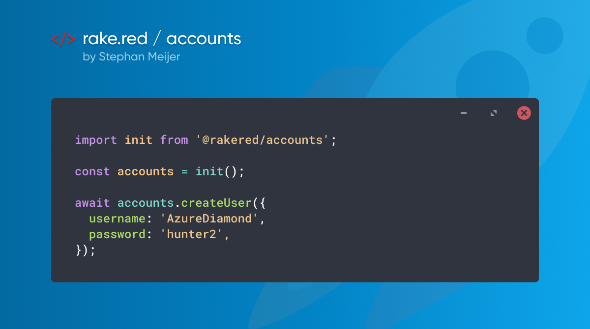

# @rakered/accounts

An account package for managing user accounts in mongodb.



This project aims to be somewhat compatible with Meteor accounts storage, Except for the email verification tokens, resume tokens, and restrictions on usernames. See the [FAQ](#faq) for more specifics about that subject.

## Usage

```js
import init from '@rakered/accounts';

const accounts = init();
await accounts.createUser({ username: 'hunter', password: 'hunter2' });
```

Options can be provided in two ways, passing them as object to `init`, or by providing them as environment variables.

## Options

There are various options available. In development mode, this library does not require a `MAIL_URL` to be set, instead emails will be logged to console.

### Environment Variables

Both `username` as well as `email` are optional, but one of those must be provided.

- **MAIL_URL** _String_

  The smtp url for the mail server to use.

  Optional when running in development mode

- **JWT_SECRET** _String_

  The secret to sign the jwt tokens with.

- **EMAIL_FROM** _String_

  The email address that's being used as sender.

  Optional if `options.email.from` is provided

- **BASE_URL** _String_

  The url that will be prefixed to magic urls and provided to the email template.

  Optional if `options.email.siteUrl` is provided

- **SITE_NAME** _String_

  The site name that will be provided to the email template.

  Optional if `options.email.siteName` is provided

- **LOGO_URL** _String_

  The url for the logo that will be shown in the email.

  Optional if `options.email.logoUrl` is provided

### Collection

First things first, the database connection. If you don't specify anything, it will be managed for you with [@rakered/mongo][rakered/mongo]. The account system will connect to the MongoDB instance that's available under `process.env.MONGO_URL`, and will use the `users` collection to save and read the documents.

#### custom collection name

If you just wish to specify a different collection, provide the collection name during initialization.

```js
import init from '@rakered/accounts';

const accounts = init({
  collection: 'accounts',
});
```

#### custom collection instance

If you need more control, it's also possible to pass in a MongoDB Collection instance to it.

```js
import db from '@rakered/mongo';
import init from '@rakered/accounts';

const accounts = init({
  collection: db.users,
});
```

#### using native MongoDB driver

Or even using a native MongoDB Collection

```js
import { MongoClient } from 'mongodb';
import init from '@rakered/accounts';

const client = await MongoClient.connect(process.env.MONGO_URL);
const db = await client.db();

const accounts = init({
  collection: db.collection('users'),
});
```

#### using Meteor.users collection

When migrating away from Meteor, the `rawCollection` can be used:

```js
import init from '@rakered/accounts';

const accounts = init({
  collection: Meteor.users.rawCollection(),
});
```

### Email

This library uses [@rakered/email][rakered/email] to send emails for email address verification and to send password reset tokens. The address for the smtp server is read from `process.env.MAIL_URL`, be sure to set it to any valid smtp url.

Provide the following options before you deploy to production. The values are used in the email template, and should be replaced with your own.

```js
import init from '@rakered/accounts';

const accounts = init({
  email: {
    from: 'noreply@example.com',
    siteName: 'Example',
    siteUrl: 'https://example.com',
    logoUrl: 'https://example.com/logo.png',
  },
});
```

### Token URLs

When using the email system, it's likely that you need to configure the token URLs. By default, the URLs are configured to use the format as below, but with `https://example.com` replaced by the `siteUrl` that you've configured under `email`. Meaning, the `verify-email` URL, would default to `${siteUrl}/verify-email/${token}`. If this schema matches your needs, there is no need to customize. Otherwise, adjust them to accordingly.

```js
import init from '@rakered/accounts';

const accounts = init({
  urls: {
    verifyEmail: (token) => `https://example.com/verify-email/${token}`,
    enrollAccount: (token) => `https://example.com/enroll-account/${token}`,
    resetPassword: (token) => `https://example.com/reset-password/${token}`,
  },
});
```

## Methods

Methods. This library comes with various methods to manage the accounts.

### `createUser(options)`

Create a new user.

#### options

Both `username` as well as `email` are optional, but one of those must be provided.

- **username** _String_

  A unique name for this user. Usernames need to match the same requirements as GitHub usernames.

  - may only contain alphanumeric characters and hyphens.
  - cannot have multiple consecutive hyphens.
  - cannot begin or end with a hyphen.
  - has a minimum length of 3 characters
  - has a maximum length of 20 characters

  In addition to the GitHub requirements, there is also a list of `reserved` usernames, that cannot be claimed. Think `.wellknown`, `admin`, `own`, `owner`, `you`, `yourself`, and a bunch more.

  Lastly, usernames are not only guaranteed to be unique, but also not look-alike. To prevent confusion by end users, It's not possible to register both `smeijer` as well as `s-meijer`.

  Optional if `email` is provided

- **email** _String_

  The user's email address.

  Optional if `username` is provided

- **password** _String_ | _{ digest: String, algorithm: 'sha-256' }_

  Optional - The user's password. The password should not be send in plain text over the wire. Instead, use [@rakered/hash][rakered/hash] to hash it with sha-256 before sending it to the server. When left out, this function won't be returning refresh tokens. We assume that no password, means that the user is being invited. Use `sendEnrollmentEmail` to let them set their initial password.

- **name** _String_
  Optional - The full name of the user.

- **roles** _String[]_

  Optional - A string array with roles that should be assigned. These roles will be included in the request token, enabling permissions checks without database requests.

### `setUsername(options)`

Change a user's username. Use this instead of updating the database directly. The operation will fail if there is an existing user with a similar looking username, or if the username does not match the conditions as specified under `createUser`.

#### options

- **userId** _String_

  The ID of the user to update

- **username** _String_

  The new username for the user

### `addEmail(options)`

Add an email address for a user. Use this instead of directly updating the database. The operation will fail if there is a different user with the same email address.

#### options

- **userId** _String_

  The ID of the user to update.

- **email** _String_

  The new email address for the user

- **verified** _Boolean_

  Optional - whether the new email address should be marked as verified. Defaults to false.

### `removeEmail(options)`

Remove an email address for a user. Use this instead of updating the database directly.

#### options

- **userId** _String_

  The ID of the user to update.

- **email** _String_

  The email address to remove.

### `verifyEmail(options)`

Marks the user's email address as verified and returns an access token.

#### options

- **token** _String_

  The token retrieved from the verification URL.

### `resetPassword(options)`

Reset the password for a user using a token received in email.

#### options

- **token** _String_

  The token retrieved from the reset password URL.

- **password** _String_ | _{ digest: String, algorithm: 'sha-256' }_

  A new password for the user. The password should not be send in plain text over the wire. Instead, use [@rakered/hash][rakered/hash] to hash it with sha-256 before sending it to the server.

### `login(options)`

Obtain a `refreshToken` and `accessToken` by using password based authentication.

#### options

- **identity** _String_

  The `username` or `email` from the user for which the token should be created.

- **password** _String_ | _{ digest: String, algorithm: 'sha-256' }_

  The user's password. The password should not be send in plain text over the wire. Instead, use [@rakered/hash][rakered/hash] to hash it with sha-256 before sending it to the server.

### `refreshToken(options)`

Obtain a fresh `refreshToken` and `accessToken`. Note that the current `refreshToken` is revoked.

#### options

- **refreshToken** _String_

  The current refresh token.

- **accessToken** _String_

  The current access token.

### `revokeToken(options)`

Revoke the `refreshToken` so it can no longer be used to obtain new `accessTokens`.

#### options

- **refreshToken** _String_

  The token that should be revoked.

- **accessToken** _String_

  The current access token.

### `sendEnrollmentEmail(options)`

Send an email with a link the user can use to set their initial password.

#### options

- **userId** _String_

  The id of the user to send email to.

- **email** _String_

  Optional. Which address of the user's to send the email to. This address must be in the user's `emails` list. Defaults to the first email in the list.

### `sendVerificationEmail(options)`

Send an email with a link the user can use verify their email address.

#### options

- **userId** _String_

  The id of the user to send email to.

- **email** _String_

  Optional. Which address of the user's to send the email to. This address must be in the user's `emails` list. Defaults to the first unverified email in the list.

### `sendResetPasswordEmail(options)`

Send an email with a link the user can use to reset their password.

#### options

- **userId** _String_

  The id of the user to send email to.

- **email** _String_

  Optional. Which address of the user's to send the email to. This address must be in the user's `emails` list. Defaults to the first email in the list.

### `disconnect`

Close the database connection. Useful when using accounts in console scripts.

## Properties

## `collection`

The MongoDB Collection is exposed under the `accounts.collection` property, for when you need direct access to the collection.

# Good to knows

- The email verification tokens are incompatible with Meteor, because I've taken a different approach there, to limit the database request to a maximum of 1 call per method. The way Meteor manages the verification tokens requires two requests per email verification attempt.

  I've weighted the pros and cons, and came to the conclusion that a single request outweighs the benefit of Meteor compatibility in this area. In the case where this project is connected to an existing Meteor database, it would be trivial to either migrate the tokens to the format of this project, or to let the user request a new verification token.

  To migrate existing tokens, check our [migration script example]

- Usernames are more strict than in Meteor, because of this it can be that your existing user collection cannot be used as source for this library. Meteor usernames are case sensitive. Meaning, `alex`, `Alex`, and `AleX` are different users. We do not support this. We can write a detection script for this, but that's something we still have to do.

[migration script example]: ./docs/migrate-meteor-verification-tokens
[rakered/mongo]: https://github.com/rakered/rakered/tree/main/packages/mongo
[rakered/email]: https://github.com/rakered/rakered/tree/main/packages/email
[rakered/hash]: https://github.com/rakered/rakered/tree/main/packages/hash
