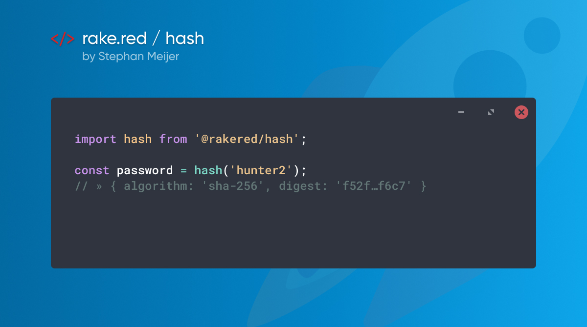

# @rakered/hash

A tiny, zero dependency, SHA256 hashing algorithm that can run in both the browser and in node.



## Usage:

```js
import hash from '@rakered/hash';

const hashedPassword = hash('hunter2');
// » { algorithm: 'sha-256', digest: 'f52f…f6c7' }
```

# Alternatives

If you're looking for something that only needs to run on nodejs, you might want to use the native `crypto` module instead.

```js
import crypto from 'crypto';

function nodeHash(data) {
  return crypto.createHash('sha256').update(data).digest('hex');
}

nodeHash('hunter2');
// » f52f…f6c7
```

If you're looking for something that only needs to run on modern browsers, you might want to use the native `crypto` module instead.

```js
async function browserHash(data) {
  const encoded = new TextEncoder().encode(data);
  const buffer = await crypto.subtle.digest('SHA-256', encoded);
  const array = Array.from(new Uint8Array(buffer));
  return array.map(b => ('00' + b.toString(16)).slice(-2)).join('');
}

await browserHash('hunter2');
// » f52f…f6c7
```